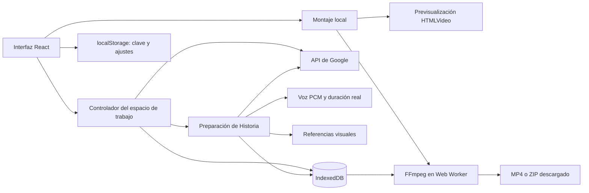

# Arquitectura

[Documentación](README.md)

## Vista general

Aplicación estática React 19 + TypeScript + Vite. El navegador contiene la interfaz, el almacenamiento, la cola de trabajo y el motor de exportación. No hay API propia, autenticación de usuarios, base de datos remota ni sincronización.

## Mapa del código

| Área                    | Archivos                                                                             | Responsabilidad                                                                           |
| ----------------------- | ------------------------------------------------------------------------------------ | ----------------------------------------------------------------------------------------- |
| Entrada y navegación    | `src/main.tsx`, `src/ui/StudioApp.tsx`                                               | Montaje de React, rutas por hash, proyectos y vistas                                      |
| Contratos de datos      | `src/types.ts`                                                                       | Proyectos, clips, versiones, referencias, solicitudes y tomas del montaje                 |
| Persistencia            | `src/lib/storage.ts`, `src/lib/settings.ts`                                          | IndexedDB, operaciones de almacenamiento, clave y preferencias                            |
| Orquestación            | `src/lib/useWorkspace.ts`                                                            | Cola paralela acotada, solicitudes, pausa, recuperación y notificaciones                  |
| Google                  | `src/lib/google.ts`, `src/lib/referenceImages.ts`                                    | REST, validación, respuestas, descargas y preparación de referencias                      |
| Biblioteca y generación | `src/ui/ProjectWorkspace.tsx`, `src/ui/Editor.tsx`                                   | Revisión de clips y modal de generación/edición/extensión                                 |
| Referencias             | `src/ui/ReferencePicker.tsx`, `src/ui/VideoReferences.tsx`                           | Selección visual, cargas y roles                                                          |
| Historia y diálogo      | `src/lib/storyPlanner.ts`, `src/lib/storyDialogue.ts`, `src/lib/storyService.ts`     | Planificación por rangos, reparto determinista de intervenciones y preparación persistida |
| Edición de Historia     | `src/ui/StoryEditor.tsx`, `src/ui/DialogueEditor.tsx`, `src/ui/StoryStylePicker.tsx` | Texto libre, conversaciones, puesta en escena y galería de estilos                        |
| Revisión de diálogo     | `src/lib/dialogueReview.ts`, `src/ui/DialogueReview.tsx`                             | Análisis multimodal opcional de una toma y comparación local de la transcripción          |
| Montaje                 | `src/lib/timeline.ts`, `src/ui/SequenceEditor.tsx`                                   | Resolución temporal, recortes, historial local y reproducción                             |
| Miniaturas              | `src/ui/SequenceFilmstrip.tsx`                                                       | Muestreo local, caché por Blob y carga cercana al área visible                            |
| Procesamiento           | `src/lib/videoEngine.ts`, `src/lib/export.ts`                                        | Worker exclusivo, FFmpeg, escalado, cortes y concatenación                                |
| Descargas               | `src/lib/archive.ts`, `src/ui/DownloadDialog.tsx`, `src/ui/VideoDownloadDialog.tsx`  | Nombres, ZIP, manifiesto opcional y selección de resolución                               |
| Presentación            | `src/ui/studio.css`, `src/ui/sequence.css`, `DESIGN.md`                              | Sistema visual y adaptación de pantallas                                                  |

## Persistencia y compatibilidad

IndexedDB conserva el nombre `vid-gen-studio`, versión de esquema 2, y los almacenes `projects`, `scenes`, `assets`, `usage_logs` y `narrations`. `scenes` y `narrations` tienen un índice `by-project`. La migración desde la versión 1 añade narraciones sin sustituir los datos existentes. Los campos nuevos son opcionales para leer registros anteriores; una migración estructural futura debe incrementar la versión y preservar los blobs.

- `Project`: tipo `kind` (`clips` o `story`), nombre, fechas, IDs de clips del montaje y `sequence_items` cuando existe un montaje detallado.
- `Scene`: borrador, ajustes, referencias, estado, versiones y solicitudes pendientes. `origin` enlaza un clip derivado con su fuente.
- `ClipVersion`: Blob, prompt, ajustes, duración declarada e identificador de interacción cuando existe.
- `Asset`: imagen como data URL, tipo y vinculación global o por proyectos.
- `SequenceItem`: ID de la toma, `scene_id`, versión fijada si existe, entrada, salida y volumen. Repetir un vídeo no duplica su blob en el proyecto.

`sceneBlob` y `activeVersion` leen la versión activa con compatibilidad para el antiguo `video_blob`. Las URL `blob:` se crean para reproducir y se revocan; no son enlaces duraderos que puedan compartirse.

`usage_logs` se conserva por compatibilidad; no representa una factura de Google ni permite calcular cargos reales. La clave está separada en localStorage; consulta [privacidad](privacy.md).

## Tipos de proyecto y navegación

`NewProjectDialog` crea proyectos vacíos con un tipo explícito. `StudioApp` conserva la ruta `#project/:id` y elige `ProjectWorkspace` para Clips o `StoryWorkspace` para Historia. El espacio de historia contiene Guion y escenas, Materiales (reutiliza la biblioteca completa de clips) y Montaje. Los borradores de las escenas siguen montados al alternar estas vistas; la reproducción se pausa al salir. La salida del montaje espera sus escrituras antes de regresar a la vista de origen.

`projectKind.ts` infiere el tipo de registros antiguos al leerlos: una historia guardada o un guion inicial no vacío en sessionStorage abre Historia; el resto abre Clips. No modifica blobs, referencias, versiones, narraciones ni secuencias. No requiere otra versión del esquema. Crear una historia persiste su tipo; `createStory` rechaza proyectos nuevos declarados explícitamente como Clips. La cola global sigue procesando trabajos de ambos tipos mientras se navega.

## Preparación de historias

`src/lib/story.ts` segmenta texto y construye prompts; `storyPlanner.ts` pide propuestas estructuradas y valida la cobertura literal del guion. `storyService.ts` guarda el avance de planificación, referencias y producción; `geminiSpeech.ts` encapsula Gemini TTS, convierte PCM en WAV y detecta pausas acústicas. El proyecto pasa por planificación, revisión, producción y preparación completa; esta última indica que los vídeos pueden estar todavía en cola. Las revisiones se guardan con control de versión. No se sintetizan tiempos por palabra. `src/ui/StoryEditor.tsx` contiene el guion y el guion gráfico. El controlador mantiene la preparación fuera de la vista, con bloqueo entre pestañas y pausa tras la petición actual. La cola existente genera las escenas en su propio registro y añade versiones. Más detalles en [Historia](story.md).

La jerarquía de personajes hablando es `StoryBlock` (escena narrativa) → `DialogueTurn` (intervención) → `Scene` (clip o toma). Cada intervención tiene `speaker`, `text`, `direction` y `action`; las dos últimas son indicaciones opcionales, separadas de las palabras. Los bloques añaden `participants`, `locationName` y `shotMode`. El planificador devuelve rangos de unidades de origen para cada intervención; la aplicación reconstruye el texto y comprueba cobertura y hablantes. Un monólogo sin etiquetas puede recibir un único personaje propuesto por Gemini. En voz en off se conserva el texto literal, sin interpretar etiquetas como reparto.

`storyDialogue.ts` reconoce las etiquetas de personajes, mantiene el orden y calcula las tomas con una estimación de palabras, caracteres y pausas. `auto` agrupa hasta dos hablantes y tres intervenciones mientras quepan; `shared` mantiene el encuadre compartido solicitado dentro del límite temporal; `alternating` separa por hablante. Las intervenciones largas se dividen sin resumir su texto. La cobertura del plan se comprueba localmente; no demuestra que el modelo de vídeo pronuncie cada palabra. `dialogueSource` vincula el diálogo estructurado al texto que lo originó: si cambia el texto libre, se vuelve a interpretar en lugar de reutilizar intervenciones obsoletas.

Los campos nuevos de `StoryBlock`, `StoryScene` y `StoryReference` son opcionales. Los proyectos anteriores con `speaker` y `text` se siguen leyendo sin migración del esquema ni sustitución de medios. Los escenarios son referencias `PRODUCT` con `locationName`, no un nuevo tipo global de `Asset`. Nano Banana recibe la descripción del escenario vacío. La selección automática reparte los tres espacios de referencia entre personajes presentes y el lugar; `storyPrompt` conserva las descripciones de reparto, oyentes, actuación y continuidad espacial. Las tomas resultantes son solicitudes independientes de la cola existente, no una cadena de extensiones ni una garantía de continuidad de voz.

`StoryEditor` agrupa la producción por bloque narrativo y conserva edición y regeneración por toma. `DialogueEditor` separa palabras, interpretación y acciones y permite revisar las tomas previstas. `StoryStylePicker` organiza la galería y la personalización; `StyleInspection` muestra detalles y compara hasta tres perfiles antes de aplicar uno explícitamente. `StyleSample` usa cinco atlas WebP locales, unos 2,4 MB en conjunto frente a unos 15,7 MB de los PNG originales conservados. Las muestras no se regeneran al modificar controles ni se adjuntan como referencias para Google.

`storyStyles.ts` reúne 58 IDs de estilo: 36 opciones de voz en off y 32 de personajes hablando. `styleExtensions.ts` aporta los últimos doce de cada modo, con descripción, uso, etiquetas y ajustes. `styleBrowsing.ts` normaliza búsqueda sin tildes y con varias palabras, ordena según el modo y guarda favoritos en localStorage (`vidgen-style-favorites`). `StoryStyleProfile` conserva base, nombre, modo, parámetros, indicaciones y análisis opcional. `storyStylePrompt` compone una prioridad explícita: parámetros sobre valores base e indicaciones personalizadas sobre ambos, solo para apariencia y puesta en escena. Se utiliza en planificación, Nano Banana y prompts de vídeo. `profileForMode` conserva perfiles personalizados —también cambios solo de nombre o parámetros— al cambiar de narración; un estilo exclusivo sin personalizar pasa a Realista si no existe en el otro modo. Los proyectos antiguos sin perfil siguen usando su ID de estilo.

La navegación interna de estilos restaura foco y desplazamiento. Al cerrar una personalización, su perfil, archivos y análisis pendiente quedan en estado del componente para retomarlos; Cancelar descarta y Usar aplica y limpia el pendiente. El panel Voz y estilo permanece montado y oculto al cambiar a Escenas para conservar ese estado. Recargar o desmontar la vista lo pierde: no es otra persistencia del proyecto. Guardar en Mis estilos sigue siendo la acción que persiste la entrada y sus archivos.

`styleLibrary.ts` usa una base IndexedDB independiente, `vidgen-style-library`, versión 1, con el almacén `styles`. Cada `SavedStoryStyle` contiene un perfil y los Blobs originales de sus referencias. `Project.story.styleProfile` es una copia de configuración, no una consulta dinámica a la biblioteca: actualizar o eliminar un estilo no cambia proyectos existentes. La base de proyectos sigue en esquema 2, sin migración. Los archivos del estilo no se copian al proyecto ni se envían automáticamente al generar.

`analyzeStyleReferences` valida hasta seis archivos y 14 MiB combinados, normaliza copias de imágenes y vuelve a comprobar el tamaño preparado antes de una única solicitud multimodal a Gemini. La salida estructurada se valida contra el catálogo del modo y todos los parámetros. La UI mantiene separada esa propuesta hasta **Aplicar análisis**; fallo, cancelación y respuesta tardía no reemplazan el borrador. Usar el perfil y guardarlo con sus archivos en la biblioteca son acciones distintas. Los parámetros son instrucciones de dirección artística, no un renderizador determinista; ni la coincidencia visual ni la precisión de diagramas o texto están garantizadas.

La revisión opcional del diálogo envía un único vídeo de hasta `14 * 1024 * 1024` bytes y las descripciones del reparto a `storyJSON`. No envía las palabras esperadas, para no orientar la transcripción. `compareDialogue` compara después los hablantes y las palabras localmente, normaliza mayúsculas y puntuación y agrupa fragmentos contiguos del mismo hablante. Una respuesta incierta nunca se presenta como coincidencia. El resultado vive en el estado del componente, ligado a la versión y el prompt; no se persiste ni dispara regeneraciones. La transcripción y la identificación de voces pueden ser incorrectas.

## Ciclo de generación

1. El usuario confirma una solicitud y su cantidad de clips.
2. Se capturan prompt, ajustes y referencias; cada salida tiene su clip y entrada de cola.
3. Las entradas se guardan antes de cerrar el modal. Un despachador admite hasta el límite configurado (3 por defecto, de 1 a 4), con un controlador y estado independiente por escena.
4. Se prepara la copia de las referencias y se envía la solicitud.
5. Cuando Google devuelve un identificador remoto, se persiste para poder consultar el resultado.
6. Al terminar, se guarda el Blob como versión. Un fallo no elimina un resultado anterior.

La cola vive en el controlador del espacio de trabajo, fuera del modal. Recargar destruye la ejecución en memoria: las solicitudes persistidas vuelven pausadas y requieren continuación o recuperación explícita. No hay service worker que siga ejecutándolas con la pestaña cerrada.

Una interrupción antes de recibir un ID remoto es ambigua. No se puede garantizar idempotencia de un nuevo POST. La recuperación con un ID conocido consulta el resultado sin crear otra generación. Véase [contrato de Google](google-api.md).

El despachador de `useWorkspace.ts` conserva un único Web Lock `vidgen-generation` durante toda la tanda, evitando envíos duplicados entre pestañas. Comparte el orden de admisión con altas, cancelaciones y prioridades; al completarse un trabajo, añadirse solicitudes o cambiar el límite, despierta para cubrir los espacios disponibles. No ejecuta dos solicitudes de la misma escena simultáneamente. Cada tarea conserva su propia captura de prompt, ajustes, imágenes e ID remoto.

Los errores detienen nuevas admisiones antes de esperar escrituras en IndexedDB; otros trabajos activos conservan su seguimiento. Un `GoogleRateLimitError` reduce la preferencia `vidgen_parallelism` a 1 y pausa, sin reintento automático. No es un error terminal: si ocurre durante el polling se mantiene el ID remoto. La pausa del usuario aborta todos los seguimientos locales. Los resultados que no caben en IndexedDB se conservan por separado en memoria para descargarlos. Las exportaciones locales de FFmpeg siguen siendo seriales.

## Montaje no destructivo

`sequence_ids` conserva la compatibilidad y las marcas de la biblioteca. `sequence_items` representa las ocurrencias reales, permitiendo duplicados y divisiones. Los proyectos anteriores sin una secuencia explícita mantienen su orden heredado; los nuevos empiezan vacíos.

En clips normales, la duración leída del vídeo prevalece sobre la duración declarada por la generación. En escenas con voz en off, el rango de narración define la duración del fragmento; una imagen más corta mantiene su último fotograma. `follow_active` permite que las tomas de Historia sigan una regeneración o restauración de versión. `resolveTimeline` aplica límites a los recortes y calcula los inicios consecutivos sin huecos. `splitSequence` transforma una toma en dos rangos contiguos de la misma fuente. La versión fijada evita cambiar una toma silenciosamente al seleccionar otra generación en la biblioteca.

La previsualización usa HTMLVideo y precarga la toma siguiente; en Historia con voz en off un elemento de audio lleva el reloj, con la imagen original silenciada; no genera un archivo por cada cambio. La decodificación y el salto entre fuentes dependen del navegador. La referencia temporal del montaje es de 24 fps; no es un monitor de precisión para todos los códecs y dispositivos.

Los cambios se guardan serialmente. Deshacer/rehacer es un historial de la sesión del editor, no una pila persistida después de recargar. El bucle de revisión, el zoom, la vista ampliada y el panel móvil son controles temporales. Eliminar una toma del montaje no elimina el clip; la papelera de clips conserva las posiciones y recortes para su restauración.

## Exportación

El motor FFmpeg se importa bajo demanda y solo admite un trabajo a la vez. Cancelar termina el worker; el siguiente trabajo crea otro. Los archivos temporales se eliminan al terminar cuando el motor sigue disponible.

Los clips individuales en resolución Original conservan sus bytes. El escalado transcodifica el vídeo con Lanczos y conserva el audio por copia. Un montaje aplica los puntos de entrada/salida y el volumen, encaja cada toma en el formato elegido, normaliza a H.264/AAC y 24 fps, y concatena los resultados. Una toma recortada también pasa por ese proceso aunque sea la única.

El ZIP contiene medios y un manifiesto opcional; no es un formato de copia de seguridad ni una vía de importación al editor.

El ZIP **Voz y guion** de Historia conserva `guion-original.txt` y `escenas.json` (`vidgen-story-materials-v2`). Cada toma exporta además `dialogue`, `participants` y `location` cuando existen, junto a texto, imagen prevista y rangos de audio. Los consumidores del manifiesto deben aceptar que esos campos falten en proyectos anteriores. La revisión temporal de diálogo no forma parte de la exportación.

## Límites de diseño

No se implementan edición multipista, transiciones, títulos, importación general de vídeo externo, exportación XML/EDL, copias completas de proyectos, colaboración ni cuentas. Cualquier cambio en estas áreas necesita definir nuevos contratos; no debe simular una capacidad que el exportador no pueda reproducir.
